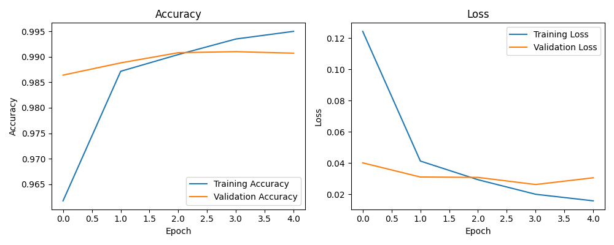
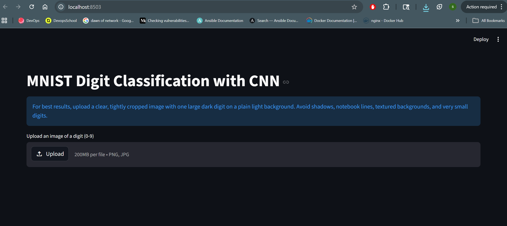
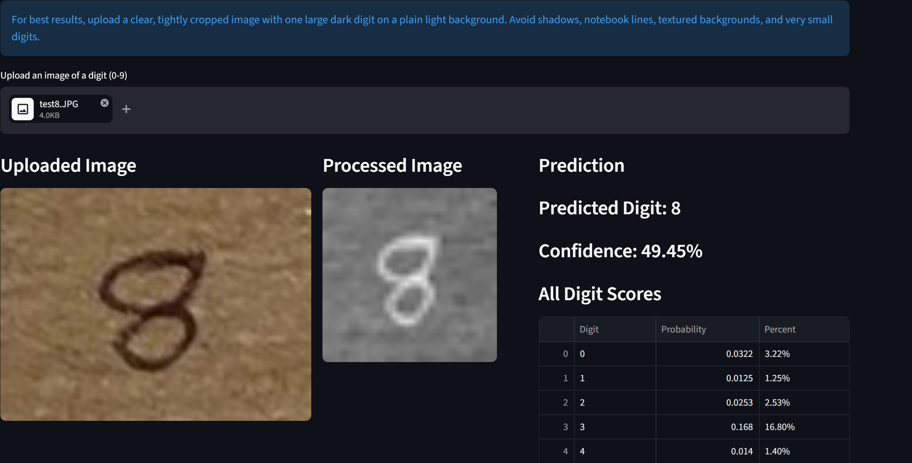
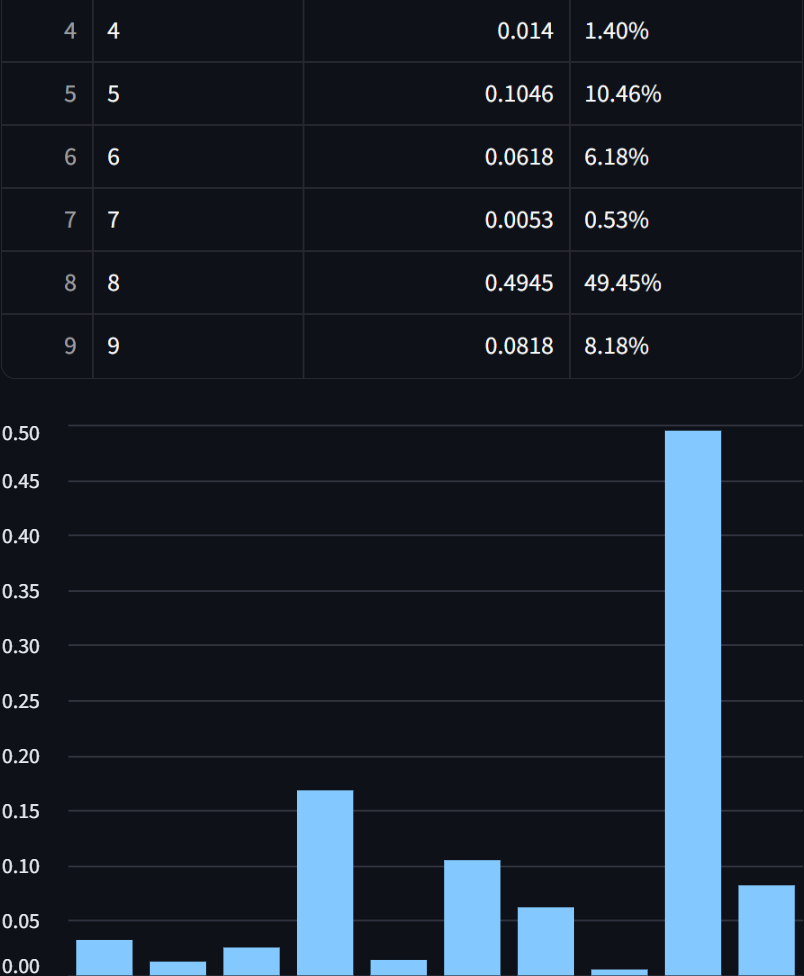
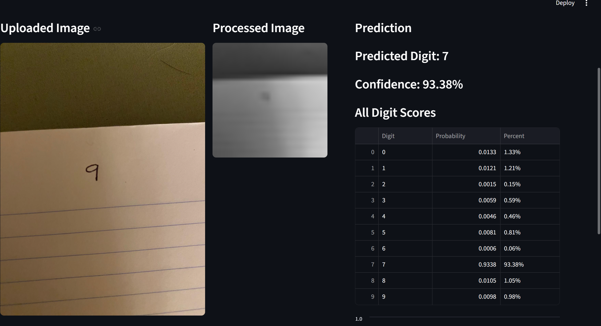
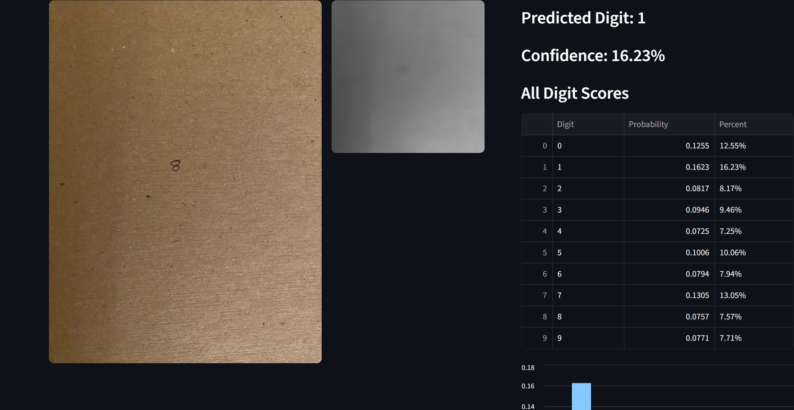

MNIST Digit Classification with CNN

A deep learning web application for handwritten digit recognition using a Convolutional Neural Network (CNN) trained on the MNIST dataset.

The application allows users to upload an image of a handwritten digit (0–9) and predicts the digit along with confidence scores for all classes.

Features:

    High Accuracy CNN: Built with TensorFlow/Keras using a multi-layer convolutional approach.

    Smart Preprocessing: Includes an automated logic that handles grayscale conversion, resizing, and contrast adjustment.

    Background Inversion: Automatically detects light/dark backgrounds to ensure the input matches the model's training data (white digit on black background).

    Real-time Insights: View prediction confidence, probability tables, and visual bar charts in the web UI.

    Training Visuals: Automatically generates accuracy and loss plots during the training phase.

Project Structure:

    | mnist_project/                                                                |
    |-------------------------------------------------------------------------------|
    |     ├── model/                                                                |
    |     │   ├── mnist_cnn_model.keras  # Saved model weights                      |
    |     │   └── training_plot.png      # Visualized training history              |
    |     ├── src/                                                                  |
    |     │   ├── data_loader.py         # MNIST dataset acquisition                |
    |     │   ├── preprocessing.py       # Data normalization and inversion logic |
    |     │   ├── model.py               # CNN architecture definition              |
    |     │   └── utils.py               # Model saving and plotting helpers        |
    |     ├── app.py                     # Streamlit web application                |
    |     ├── train_model.py             # Model training script                    |
    |     └── requirements.txt           # Dependencies     

Technologies Used
        Python
        TensorFlow / Keras
        Streamlit
        NumPy
        Pandas
        PIL (Pillow)
        CNN Architecture

The model uses a sequential Convolutional Neural Network (CNN) for image digit classification.

Typical architecture:    

    | Layer Type     | Parameters              | Activation |
    |----------------|-------------------------|------------|
    | Input          | 28 x 28 x 1             | N/A        |
    | Conv2D         | 32 filters 3 x 3 kernel | ReLU       |
    | MaxPooling2D   | 2 x 2 pool size         | N/A        |
    | Conv2D         | 64 filters 3 x 3 kernel | ReLU       |
    | MaxPooling2D   | 2 x 2 pool size         | N/A        |
    | Flatten        | Converts 2D to 1D       | N/A        |
    | Dense (Hidden) | 128 units               | ReLU       |
    | Dense (Output) | 10 units                | Softmax    |

The model is trained using the MNIST dataset: 

    60,000 training images
    10,000 testing images
    Grayscale handwritten digits (0–9)
    Image size: 28×28 pixels

Model Evaluation:

    The model was trained for 5 epochs on the MNIST dataset. The training results show high accuracy (~99%) and a well-optimized loss curve:

    

Installation

    Clone the repository:

        git clone https://github.com/nagavenkatakolli/machinelearning.git

        cd machinelearning

    Create a virtual environment:

        python -m venv .venv
        source .venv/bin/activate

    Install dependencies:

        pip install -r requirements.txt

Train the Model 
    This is for information purpose , incase if you want to build a model 
    but the repo already has a model saved you can skip the following step

    Run:python train_model.py

The trained model will be saved in:
    In the repo this alredy you do not have to train again, trainig is optional

    model/mnist_cnn_model.keras

Run the Streamlit App   

    Once you install requirements.txt, you can direcly start streamlit using following command
    and should be able to upload image

    Start the web application:

        streamlit run app.py

Open in browser:

    http://localhost:8501
    Image Preprocessing

Uploaded images are preprocessed before prediction:
Below are the steps how image preprocessed before prediction

    Convert image to grayscale - Removes color interference
    Resize to 28×28
    Auto contrast adjustment - sharpen the digit against the background
    Normalize pixel values
    Reshape for CNN input
    Example Workflow
    Upload a handwritten digit image
    Image is preprocessed
    CNN model predicts the digit
    Application displays:
    Predicted digit
    Confidence score
    Probability scores for all digits
    Limitations

This model is trained only on the MNIST dataset.

Predictions work best when:

    1.digit is large and centered
    2.background is plain
    3.image is tightly cropped
    4.digit has strong contrast

Known Limitations:
As shown in the evaluation photos, accuracy may decrease if the digit is off-center
or the background is heavily textured (e.g., notebook lines).

    noisy backgrounds
    notebook lines
    shadows
    textured surfaces
    very small digits
    Future Improvements
    Better preprocessing pipeline
    Automatic digit segmentation
    Support for multiple digits
    Data augmentation
    Higher accuracy CNN architectures

Screenshots:

Example:

Limitations:
As mentioned if the background is noisy or not centered there is limitation 

Author

Nagavenkata Kolli

License

This project is for educational and academic purposes.
